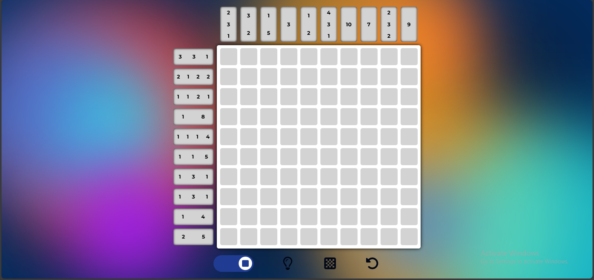

# Nonogram Solver (Proyecto Académico) | `uns-nonogram-react-prolog`

![[Agrega un GIF o Screenshot de tu juego Nonograma aquí]](./assets/lcc.png)

Este es un juego web para resolver "Nonogramas" (también conocidos como Picross o Griddlers), desarrollado para la materia **Lógica para Ciencias de la Computación (5704)** en la Universidad Nacional del Sur (UNS).

El proyecto consiste en una aplicación _full-stack_ que utiliza **React** para la interfaz de usuario y **Prolog** en el backend como un motor de lógica declarativa para procesar y resolver los puzzles. El objetivo era aplicar teorías lógico-matemáticas (como la lógica proposicional) en un problema práctico.

---

### 👥 Autores y Equipo

_(Ajusta esto según si lo hiciste solo o en equipo)_

- **Juan Román Brugnoni** ([@JRoman-brug](https://github.com/JRoman-brug))
- **Franco Agustín Popp** ([@FrancoPopp](https://github.com/FrancoPopp))

---

### 🛠️ Stack Tecnológico

- **Frontend:** React, JavaScript, HTML5, CSS3
- **Backend:** Prolog
- **[Middleware/API]**: [Menciona cómo conectaste React y Prolog. ¿Fue con un servidor de Node.js/Express que ejecutaba el script de Prolog? ¿O una herramienta específica de Prolog?]
- **Control de Versiones:** Git

---

### 🎮 Gameplay y Características

El juego cuenta con una interfaz limpia donde el usuario puede resolver los puzzles. El motor lógico en Prolog se encarga de...

 ---

### 🚀 Cómo Ejecutar el Proyecto

_(Esta sección es crucial. Debes detallar cómo correr AMBAS partes, el backend de Prolog y el frontend de React. Esto es un ejemplo general)._

#### 1. Backend (Prolog)

1.  Navegar a la carpeta del backend: `cd pengines_server`
2.  Tener instalado un intérprete de Prolog (ej. [SWI-Prolog](https://www.swi-prolog.org/)).
3.  Ejecutas el run.pl
    ```bash
    # Ingresar a la carpeta pengines_server
    cd pengines_server
    # Cargar el archivo principal en el intérprete
    swipl run.pl
    ```

#### 2. Frontend (React)

1.  Navegar a la carpeta del frontend: `cd frontend-react`
2.  Instalar las dependencias:
    ```bash
    npm install
    ```
3.  Iniciar la aplicación de desarrollo:
    ```bash
    npm start
    ```
4.  Abrir [http://localhost:3000](http://localhost:3000) en el navegador.

---

### 💡 Lecciones Aprendidas

Este proyecto fue un desafío fascinante al integrar dos paradigmas de programación completamente distintos.

- **Integración de Paradigmas:** Logramos conectar una aplicación web moderna, basada en componentes y estado (React), con un backend de programación lógica declarativa (Prolog).
- **Lógica Aplicada:** Pude aplicar directamente los conceptos teóricos de la materia (lógica proposicional) para construir un _solver_ funcional.
- **Mejora de Rendimiento (Futuro):** El _solver_ actual funciona bien para tableros pequeños.
  - **Mejora a futuro:** Como siguiente paso, optimizaría el motor de Prolog implementando **heurísticas** para reducir el espacio de búsqueda y mejorar drásticamente los tiempos de cómputo en tableros de gran tamaño.
- **Flujo de Trabajo (Futuro):**
  - **Mejora a futuro:** Implementaría un **flujo de trabajo de Git** más estructurado para gestionar las _features_ del frontend y los cambios en el motor lógico del backend de forma independiente y ordenada.
